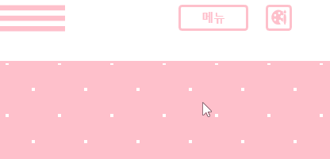

## 직소 퍼즐 사이트
> [PengCatPuzzle](https://pengcatpuzzle.vercel.app)

- 캔버스를 활용할 수 있는 무언가를 만들고 싶었던 필자는 직소 퍼즐 사이트를 만들기로 하였다. 캔버스를 활용한다는 것은 많은 수학적인 계산을 해야 한다는 것이고, 그 점이 참 맘에 들었다.
- 기존에 있는 직소 퍼즐 사이트와의 차별점을 두고 싶었다.


	1. 처음 웹사이트에 들어온 사람도 쉽게 알 수 있는 직관적이고 유저 친화적인 UI/UX
	2. 내가 만든 퍼즐을 공유해서 맞출 수 있게
	3. 비밀 방을 만들어 초대한 사람만 맞출 수 있게
	4. 초대하기 편하게 친구 추가할 수 있게
	5. 초대•친구 요청에 소켓 통신을 적용하여 토스트 알림
    
## 퍼즐 생성
### 퍼즐 생성
- 간단한 UI로 새로운 퍼즐을 생성할 수 있다.
- 퍼즐 이미지를 등록하면 생성할 수 있는 퍼즐 수를 고를 수 있다. 퍼즐 수 목록은 퍼즐 조각이 정사각형에 가까운 모양이 될 수 있게(정사각형에서 10%의 여유) 제공한다.
- 로그인 없이 간단히 즐기려면 혼자 하기를 선택하고(새로 고침 시 퍼즐 맞춘 것 초기화), 로그인을 하였다면 퍼즐 방을 만들어 두고두고 즐길 수 있다.


### 퍼즐 조각 생성
> [퍼즐 조각 생성 방법](https://www.codeproject.com/Articles/395453/Html5-Jigsaw-Puzzle)

- 여기서 퍼즐 조각 모양을 변경하였다.
- `paper` 라이브러리의 `Path` 클래스는 `cubicCurveTo` 메서드가 있다. 메서드를 살펴보면 3개의 인자는 베지어 곡선의 시작점을 제외한 3개의 좌표다. 좌표 위치는 그래프로 가장 퍼즐 조각 모양에 가깝게 그려 가져왔다.
```javascript
cubicCurveTo: function() {
  var args = arguments,
      handle1 = Point.read(args),
      handle2 = Point.read(args),
      to = Point.read(args),
      current = getCurrentSegment(this);
  current.setHandleOut(handle1.subtract(current._point));
  this._add([ new Segment(to, handle2.subtract(to)) ]);
},
```

> [퍼즐 조각 모양 그래프](https://www.desmos.com/calculator/6y1drxzkkv?lang=ko)


### 퍼즐 배치
- 퍼즐을 배치 할 때 퍼즐을 맞출 수 있는 빈 공간을 두고, 그 주위로 퍼즐을 배치하였다.
- 다음 두 변수를 만들었다.
```javascript
const batchStandard = Math.ceil(Math.sqrt(config.tilesPerRow * config.tilesPerColumn));
const batchTiles = Math.ceil(batchStandard * 1.5);
```
- `batchStandard`는 퍼즐을 맞출 수 있는 빈 정사각형 공간의 한 변의 퍼즐 조각 수다.
- `batchStandard`의 제곱은 항상 퍼즐 조각 수보다 크므로 `batchStandard`가 한 변인 정사각형만큼 비워둔다면 퍼즐을 맞추기에 충분하다고 판단되었다.
- `batchTiles`는 `batchStandard`의 1.5배 이상이므로 `batchTiles`가 한 변인 정사각형 안에 `batchStandard`가 한 변인 정사각형만큼의 공간을 비워두고 남은 공간에 퍼즐 조각을 배치한다 해도 넘치지 않을 것이 분명했다.
- 빈 공간을 가진 배치의 위치 정보를 차례대로 배열에 저장한 다음, 랜덤으로 꺼내서 퍼즐 조각마다 하나씩 할당해주었다.


## 퍼즐 움직이기
- 퍼즐을 움직이는 것은 3가지 동작으로 분류된다.


	1. onMouseDown(집기)
    2. onMouseDrag(이동하기)
    3. onMouseUp(놓기)

### onMouseDown(집기)
- 선택한 퍼즐 조각의 레이어를 최상위로 올려 다른 퍼즐 조각에 가려지지 않게 한다.
- 집은 퍼즐 조각의 인덱스를 소켓 통신으로 전송하여 다른 플레이어들은 해당 퍼즐 조각을 이동시킬 수 없게 한다.

### onMouseDrag(이동하기)
- 퍼즐 조각 마우스로 드래그한 정도만큼 이동시킨다.
- 캔버스 화면 밖으로 이동시키는 것은 막는다.

### onMouseUp(놓기)
- 퍼즐 조각을 맞춘다.(아래 설명)
- 완성도를 구한다. (맞춰진 퍼즐 수 / (전체 퍼즐 수 - 1))
- 완성도가 1이라면 폭죽을 터트리고, 완성된 퍼즐을 다운로드할 수 있는 모달을 띄운다.
- 퍼즐 위치 및 완성도를 서버로 전송한다. 서버는 해당 정보를 데이터베이스에 저장하고, 다른 플레이어들에게도 소켓 통신으로 전송한다.
- 맞춰진 정도가 큰 퍼즐 조각일수록 밑으로 갈 수 있게 레이어를 조정한다. (맞춰진 퍼즐 조각들이 다른 퍼즐 조각을 가리는 것을 방지)

#### 퍼즐 조각 맟추기
- 퍼즐 조각 맞추기에 앞서 `그룹화`에 대해 설명하겠다.
- 모든 퍼즐 조각은 생성 시 배열에 퍼즐 조각의 정보와 `groupIndex`를 같이 저장한다. `groupIndex`를 `null`로 설정한다. 후에 같은 그룹일 경우 같은 숫자로 표기한다.
- 예를 들어 배열 인덱스가 `2`인 조각과 `3`인 조각이 있다. `2`인 조각을 `3`인 조각에 맞추면 둘다 groupIndex는 `2`가 된다. 집고 있는 퍼즐의 배열 인덱스로 `groupIndex`가 바뀌는 것이다.
- 같은 그룹의 퍼즐 조각끼리는 같이 움직이고, 퍼즐을 맞출 때도 같이 맞춰진다.

#### 퍼즐 맞춰지는 순서는 다음과 같다.


	1. 퍼즐의 상하좌우 위치에 해당 조각과 맞춰질 수 있는 조각이 있는지 확인한다. 맞춰질 수 있는 조각이 같은 그룹인 경우는 넘어간다. 같은 그룹 조각들도 각각의 상하좌우 위치를 확인한다. 
    2. 같은 그룹이 아닌 맞춰질 수 있는 조각이 있는 경우 해당 조각과 빈틈없게 맞아질 수 있도록 위치를 보정하여 이동시킨다.
    3. 그룹에 속한 모든 조각들도 똑같은 값만큼 이동시킨다.
    4. 이동이 끝나면 다른 맞춰질 수 있는 조각이 있더라도 동작을 마친다.

## 같이 맞추기

### socketio
- 처음에는 실시간으로 통신하여 사람들끼리 퍼즐을 맞출 수 있는 웹사이트를 기획하고, 개발하였다.
- 소켓 통신을 사용하여 내가 이동하는 퍼즐이 딜레이없이 상대방한테도 이동할 수 있게 개발하였다.
- 하지만 이 방식은 배포 과정에 있어서 문제가 생겼다.

### vercel
- 배포는 `vercel`로 하였다. 배포를 오랜 기간 동안 하며 사이트를 돌보고 싶었고, 때문에 무료 배포로 제한하다 보니 선택지가 적었다.
- `vercel`의 문제점은 `serverless deployment`를 한다는 것이다. 소켓 통신은 클라이언트가 언제 들어올지 모르니 실시간으로 서버를 열어놓고, 대기하고 있어야 하지만 `serverless deployment`는 그게 불가능하다.
- 따라서, 서버가 없는 소켓 통신을 위해 `pusher`라는 라이브러리를 사용하였다.

### pusher
- 서버가 필요없는 `pusher`라이브러리를 사용하였다. `pusher`는 내가 서버를 만들 필요는 없지만 무료 이용이라면 하루 소켓 통신 이용에 제한이 있다.
- 따라서, 퍼즐 드래그에 대하여 소켓 통신을 쓰지 않았다.
- 퍼즐을 집었을 때(집었다는 것을 다른 사람들에게 전해 움직이지 못하게)와 퍼즐을 놓았을 때(해당 위치 전송)에 대해서만 소켓 통신을 사용하였다.

### 문제점
- 소켓 통신이 실시간으로 이루어지지 않는다. 로컬 환경에서는 딜레이가 거의 없지만, 배포 환경에서는 5초 이상 지연될 때도 있었다.
- 채팅과 같은 경우라면 엄청 크게 문제가 되지 않겠지만, 퍼즐을 맞출 때는 큰 문제가 생길 수 있다.
- 예를 들어 퍼즐 조각 'A'를 'B'에 맞췄는데 다른 사용자는 퍼즐 조각 'B'를 움직인 경우, 두 행동이 지연 시간 내에 일어난다면 퍼즐이 어긋나 있지만 그룹화가 될 수 있다.

#### 해결 방안
- 해당 문제점의 해결 방안으로 3가지가 있다.


	1. 가장 근원적인 해결방안은 딜레이를 없애는 것이다. `pusher`를 사용하지 않고, 소켓 서버를 만들어 AWS로 배포하는 것이다. 가장 좋은 해결책이지만 돈이 들기 때문에 보류하겠다.
    2. 어긋나게 그룹화된 퍼즐 조각들의 그룹을 해제 시키는 것이다. 조각을 더블 클릭 할 경우 해제 시키게 하거나, 버튼을 만들어 해당 버튼 클릭 시 어긋나 그룹화되어 있는 모든 퍼즐 조각들이 그룹 해제되는 방식등을 생각할 수 있다. 하지만 어긋나게 그룹화되는 경우가 잦기 때문에 더 정신없게 만들 수도 있다.
    3. 마지막 방안은 추가로 계산하는 것이다. 상대방이 움직인 퍼즐이 내가 움직인 퍼즐과 그룹이 되거나 겹쳐짐이 있을 때 그런 부분까지 계산해서 이동시키고, 해당 계산 결과를 서버로 보내주면 된다. 가장 가능성 있는 방안이지만 계산 방식이 복잡하므로 시간의 여유가 있을 때 시도해보겠다.

## 디자인 테마
- 테마는 4가지 색상을 적용하였다.
- 방식 및 코드는 아래 링크에 정리해두었다.



> [Nextjs 다양한 테마 적용하기 with SSR](https://velog.io/@catca/Nextjs-%EB%8B%A4%EC%96%91%ED%95%9C-%ED%85%8C%EB%A7%88-%EC%A0%81%EC%9A%A9%ED%95%98%EA%B8%B0-with-SSR)

## 알림 메시지
- 토스트와 팝업 창은 내 행동뿐만 아니라 다른 유저의 행동에 따라서도 반응한다. 내가 퍼즐을 맞출 때 누군가가 들어오거나 친구 요청을 받았을 때가 그 예다.
- `_app.tsx`에 소켓 통신을 위한 컴포넌트를 넣어 사용자의 데이터베이스 id로 소켓 통신 방을 만들어 통신하였다.

### 토스트


- 토스트는 여러 가지 알림을 알림 메시지는 크게 3종류 구분된다. 알림 메시지는 오른쪽 상단에 뜬다.


	1. success: 성공, 친구를 요청하거나, 친구를 퍼즐 방에 초대하거나와 같이 주로 사용자가 한 행동에 성공할 경우 알려준다.
    2. warning: 경고, 친구 요청에 실패하거나 퍼즐 방을 만들 때 채워놓지 않은 부분이 있을 경우와 같이 주로 사용자가 한 행동에 오류가 있을 때 알려준다.
    3. info: 정보, 퍼즐 방에 누군가 들어왔을 때와 같이 다른 사용자가 한 행동에 대해 알려준다.
    

    
### 팝업 창


- 친구 요청 받았거나, 친구 요청 받았을 때 오른쪽 하단에 팝업 창이 뜬다. 사용자는 팝업 창으로 실시간 정보를 얻고, 친구 요청이나 퍼즐 방 초대를 수락할 수 있다.
